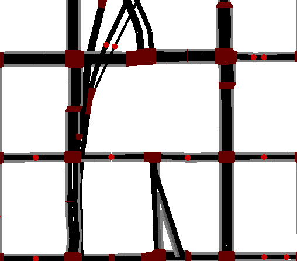
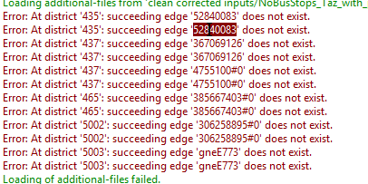
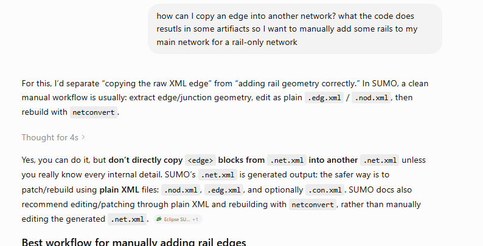
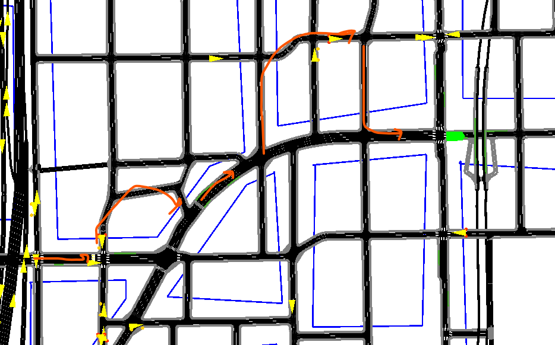

# read this before working on gtfs/DT simulation

### 1-this work was start by Zili Qu. 
She has a doc about the things she did. Read her stuff in `/Zili` first. 

### 2- in this directory, I regenerated her work. 
you can run `simulation.sumocfg` to run the modified verion or Zili's train or bus simulations. 
Here I fixed some network issues first (some rail tracks were not connected properly in `Zili\rail\toy network\seattle_lightrail_full.net.xml'` and in `merged.net.xml` that Zili made)
, then ran her codes to regenerate sumo files for bus and rail gtfs separately, and then combined them to make a simulation with both bus and rail.

### 3- debugging is needed
- Format:
    - `gtfs2pt` outputs are `add.xml` files and demand is not in `rou.xml` files. maybe it's better to have `rou.xml` file for demand. 
    - make sure that stop and trip names are what we expect based on GTFS files. This is particularly important regarding working with codes in `ridership`.
- Rail: 
    - we can do some preprocessing on gtfs data so that we only capture trips between Judkins park, UW, and SODO. the filtering that the code currently does is not effective. This one is also not very important but it would be nicer not to have a very big area for simulation. 

network: 
- run the `netconvert` command in the notebook one more time. you will recieve some network warnings. I suggest spending some time to find geometry issues of the network. By correct premissions in `soheil_seattle_correct_premissions` we mean that we allowed 'tram' for rail tracks and that was needed to make gtfs2pt work with no errors. 
- (**You may ignore the following network issues. soheil_seattle_merged.net.xml works well with older sim files. didn't remove them to keep track later.**)
  - The way Zili used SUMO commands to merge rail network (only the parts that were out of DT)
  and the older network file (the one in `/clean corrected inputs`) leads to some artifacts. For example, compare the old `.net.xml` file with the new one in this folder and see what happened to SR99 entrance.
  I think the best way to complement the rail network is simply by adding new edges from the rail network to the xml file of the old network directly,
  without using netedit or netconvert. 
  - I tried adding manually. not a good idea. coordinates mess up and gtfs2pt won't work properly. the reason behind Zili's 
  network problem is that her rail network has nodes like J0 and edges like E1. there are similar nodes/edges in the DT network. so I chnaged those names in the rail network and tried Zili's work again

<p align="center">
  
</p>





Bus:
- This is the main part that needs to be addressed. see below
- first of all: bus routes seems to be bad. they don't take most obvious routes! see screenshot below for a bus in line 8. 
could be a premission issue or speed issue. Probably the later because from old sim we know old network has some speed issues when sidewalks have low speeds compared to vehicle lanes.


- second: buses need to filtered and then added to the network. current filterning method is not very good (in notebook file)
Below is ChatGPT review of what we need to address for bus trips. I asked it to read ipynb file and the log when gtfs2pt is run for bus gtfs.

- In general, the proper workflow should include selecting specific routes, filtering them properly to be suitable for the incomplete network we have, and then run gtfs2pt on that. after that, we should carefully read the `gtfs2pt` log  and look at the simulation and how buses behave in simulation compared to our expectation. 

- Note that if you run Zili's bus simulation, you would face an error in simulation. that simulation is based on 12 routes that can be found in the ipynb file. Obviously this error should be fixed.

---------------------

# Review of `gtfs2pt.py` Log for KCM Bus Lines

The `gtfs2pt.py` command for the KCM bus GTFS appears to **run successfully**, but the output should **not be considered fully reliable yet**.

The script does not crash, and it does generate output files. However, the log shows several warning signs that the bus routes are not being mapped cleanly to the SUMO network.

## What Looks OK

The command successfully loads the SUMO network and the filtered GTFS file:

```text
Loading net
Loading GTFS data "gtfs data/kcm_google_transit_downtown.zip"
Success.
Writing fcd file "fcd\gtfs\bus.fcd.xml"
mapping bus
```

This means the basic inputs are readable:

- the SUMO network file is accepted;
- the filtered KCM GTFS zip is accepted;
- the selected bus GTFS data can be processed;
- the script is able to start generating bus-related SUMO output.

So, from a purely technical standpoint, the import process runs.

## Main Problems in the Log

### 1. Some GTFS points have no candidate SUMO edges

The log reports messages like:

```text
Found no candidate edges for ...
7 Points had no candidates.
```

This means some GTFS stop or trace points could not be matched to nearby usable SUMO road edges.

This is usually caused by one or more of the following:

- the stop is outside the SUMO network boundary;
- the stop is near the network edge but not close enough to a valid edge;
- the road exists geographically but is missing from the SUMO network;
- the edge exists but does not allow buses;
- the search radius is too small;
- the GTFS stop coordinate is closer to the wrong side of a divided road or one-way street.

This is a warning sign because if stops cannot be matched correctly, the generated public transport routes may become incomplete or distorted.

### 2. Some mapped routes have very large detour factors

The log reports large detour factors, for example:

```text
detour (factor 26.79)
detour (factor 17.55)
detour (factor 13.63)
```

These are not normal for a clean import.

A large detour factor means SUMO found a path between two mapped points, but that path is much longer than expected. For example, a detour factor of `26.79` means the mapped route segment is almost 27 times longer than the direct distance between the two points.

This usually means one or more of the following:

- stops are mapped to the wrong edges;
- stops are mapped to the wrong travel direction;
- the network is disconnected;
- bus access is not allowed on the expected road edges;
- the route is forced to take an unrealistic path;
- the filtered GTFS trip was chopped and no longer represents a realistic continuous route.

This is a serious quality issue. Even if SUMO generates a route, the route may not represent the actual bus movement.

### 3. Some bus routes are disconnected

The most serious warning is of this form:

```text
Warning! Disconnected route '800890320' between '456124866' and '460421475#1', no path found. Keeping longer part.
```

This means SUMO could not find a valid path between two consecutive mapped route segments.

When this happens, `gtfs2pt.py` keeps only the longer connected part of the route and discards the disconnected part.

That means some bus routes are likely being **silently shortened or chopped**.

This is especially important because the script may still finish successfully, but the generated bus routes may no longer match the intended GTFS service.

## Overall Diagnosis

The bus GTFS import is **technically successful but not clean**.

The output is useful for inspection and debugging, but I would not yet trust it for final simulation runs.

The main issues are:

- some GTFS points cannot be mapped to SUMO edges;
- some mapped route segments have unrealistic detours;
- some routes are disconnected;
- some generated bus routes may be incomplete;
- the filtered downtown-only GTFS may have created chopped trips.

The rail/tram import looked much cleaner. The KCM bus import has real mapping and network-connectivity issues that should be fixed before using the generated bus demand seriously.

## Suggestions: What to Do and What to Fix

- **Avoid clipping GTFS only by stops inside the bounding box without checking trip continuity.** This can create partial trips and disconnected route fragments.
- **Inspect the problematic stop IDs and edge IDs from the log** in NetEdit or with a simple map plot.
- **Verify bus permissions on the relevant SUMO edges.** Missing bus access can cause no-path and detour problems.
- **Check network connectivity near the problematic edges.** Some roads may be disconnected, one-way in the wrong direction, or missing turn connections.
- **Only adjust stop-matching radius after checking geometry.** A larger radius can help, but it can also map stops to wrong edges.
- **Consider importing fuller KCM trips first, then limiting demand or simulation area later**, instead of aggressively clipping the GTFS before running `gtfs2pt.py`.
