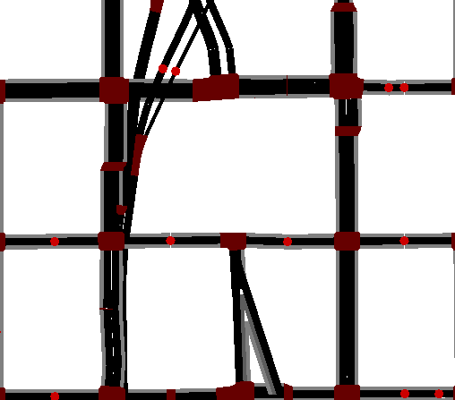
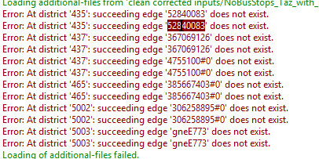
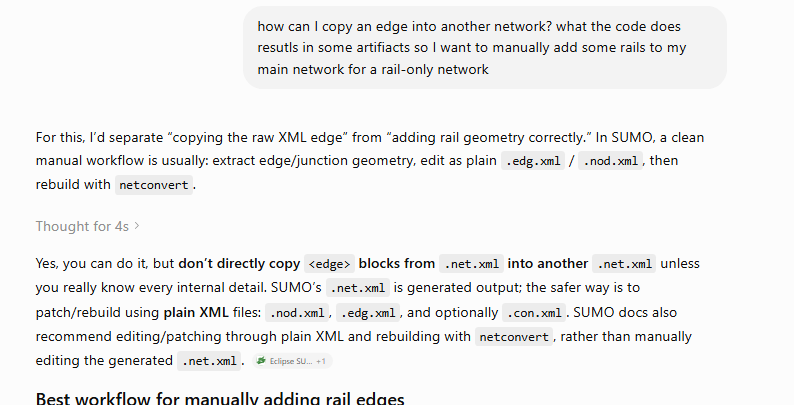
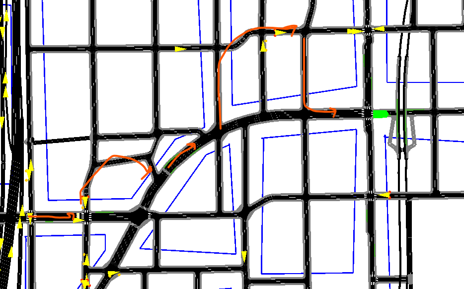

# read this before working on gtfs/DT simulation

### 1-this work was start by Zili Qu. 
She has a doc about the things she did. Read her stuff in `/Zili` first. 

### 2- in this directory, I regenerated her work. 
you can run `simulation.sumocfg` to run the modified verion or Zili's train or bus simulations. 
Here I fixed some network issues first (some rail tracks were not connected properly in `Zili\rail\toy network\seattle_lightrail_full.net.xml'` and in `merged.net.xml` that Zili made)
, then ran her codes to regenerate sumo files for bus and rail gtfs separately, and then combined them to make a simulation with both bus and rail.

### 3- debugging is needed
- Format:
    - `gtfs2pt` outputs are `add.xml` files and demand is not in `rou.xml` files. maybe it's better to have `rou.xml` file for demand. 
    - make sure that stop and trip names are what we expect based on GTFS files. This is particularly important regarding working with codes in `ridership`.
- Rail: 
    - we can do some preprocessing on gtfs data so that we only capture trips between Judkins park, UW, and SODO. the filtering that the code currently does is not effective. This one is also not very important but it would be nicer not to have a very big area for simulation. 

network: 
- run the `netconvert` command in the notebook one more time. you will recieve some network warnings. I suggest spending some time to find geometry issues of the network. By correct premissions in `soheil_seattle_correct_premissions` we mean that we allowed 'tram' for rail tracks and that was needed to make gtfs2pt work with no errors. 
- (**You may ignore the following network issues. soheil_seattle_merged.net.xml works well with older sim files. didn't remove them to keep track later.**)
  - The way Zili used SUMO commands to merge rail network (only the parts that were out of DT)
  and the older network file (the one in `/clean corrected inputs`) leads to some artifacts. For example, compare the old `.net.xml` file with the new one in this folder and see what happened to SR99 entrance.
  I think the best way to complement the rail network is simply by adding new edges from the rail network to the xml file of the old network directly,
  without using netedit or netconvert. 
  - I tried adding manually. not a good idea. coordinates mess up and gtfs2pt won't work properly. the reason behind Zili's 
  network problem is that her rail network has nodes like J0 and edges like E1. there are similar nodes/edges in the DT network. so I chnaged those names in the rail network and tried Zili's work again

<p align="center">
  
</p>





Bus:
- This is the main part that needs to be addressed. see below
- first of all: bus routes seems to be bad. they don't take most obvious routes! see screenshot below for a bus in line 8. 
could be a premission issue or speed issue. Probably the later because from old sim we know old network has some speed issues when sidewalks have low speeds compared to vehicle lanes.


- second: buses need to filtered and then added to the network. current filterning method is not very good (in notebook file)
Below is ChatGPT review of what we need to address for bus trips. I asked it to read ipynb file and the log when gtfs2pt is run for bus gtfs.

- In general, the proper workflow should include selecting specific routes, filtering them properly to be suitable for the incomplete network we have, and then run gtfs2pt on that. after that, we should carefully read the `gtfs2pt` log  and look at the simulation and how buses behave in simulation compared to our expectation. 

- Note that if you run Zili's bus simulation, you would face an error in simulation. that simulation is based on 12 routes that can be found in the ipynb file. Obviously this error should be fixed.

---------------------

# Review of `gtfs2pt.py` Log for KCM Bus Lines

The `gtfs2pt.py` command for the KCM bus GTFS appears to **run successfully**, but the output should **not be considered fully reliable yet**.

The script does not crash, and it does generate output files. However, the log shows several warning signs that the bus routes are not being mapped cleanly to the SUMO network.

## What Looks OK

The command successfully loads the SUMO network and the filtered GTFS file:

```text
Loading net
Loading GTFS data "gtfs data/kcm_google_transit_downtown.zip"
Success.
Writing fcd file "fcd\gtfs\bus.fcd.xml"
mapping bus
```

This means the basic inputs are readable:

- the SUMO network file is accepted;
- the filtered KCM GTFS zip is accepted;
- the selected bus GTFS data can be processed;
- the script is able to start generating bus-related SUMO output.

So, from a purely technical standpoint, the import process runs.

## Main Problems in the Log

### 1. Some GTFS points have no candidate SUMO edges

The log reports messages like:

```text
Found no candidate edges for ...
7 Points had no candidates.
```

This means some GTFS stop or trace points could not be matched to nearby usable SUMO road edges.

This is usually caused by one or more of the following:

- the stop is outside the SUMO network boundary;
- the stop is near the network edge but not close enough to a valid edge;
- the road exists geographically but is missing from the SUMO network;
- the edge exists but does not allow buses;
- the search radius is too small;
- the GTFS stop coordinate is closer to the wrong side of a divided road or one-way street.

This is a warning sign because if stops cannot be matched correctly, the generated public transport routes may become incomplete or distorted.

### 2. Some mapped routes have very large detour factors

The log reports large detour factors, for example:

```text
detour (factor 26.79)
detour (factor 17.55)
detour (factor 13.63)
```

These are not normal for a clean import.

A large detour factor means SUMO found a path between two mapped points, but that path is much longer than expected. For example, a detour factor of `26.79` means the mapped route segment is almost 27 times longer than the direct distance between the two points.

This usually means one or more of the following:

- stops are mapped to the wrong edges;
- stops are mapped to the wrong travel direction;
- the network is disconnected;
- bus access is not allowed on the expected road edges;
- the route is forced to take an unrealistic path;
- the filtered GTFS trip was chopped and no longer represents a realistic continuous route.

This is a serious quality issue. Even if SUMO generates a route, the route may not represent the actual bus movement.

### 3. Some bus routes are disconnected

The most serious warning is of this form:

```text
Warning! Disconnected route '800890320' between '456124866' and '460421475#1', no path found. Keeping longer part.
```

This means SUMO could not find a valid path between two consecutive mapped route segments.

When this happens, `gtfs2pt.py` keeps only the longer connected part of the route and discards the disconnected part.

That means some bus routes are likely being **silently shortened or chopped**.

This is especially important because the script may still finish successfully, but the generated bus routes may no longer match the intended GTFS service.

## Overall Diagnosis

The bus GTFS import is **technically successful but not clean**.

The output is useful for inspection and debugging, but I would not yet trust it for final simulation runs.

The main issues are:

- some GTFS points cannot be mapped to SUMO edges;
- some mapped route segments have unrealistic detours;
- some routes are disconnected;
- some generated bus routes may be incomplete;
- the filtered downtown-only GTFS may have created chopped trips.

The rail/tram import looked much cleaner. The KCM bus import has real mapping and network-connectivity issues that should be fixed before using the generated bus demand seriously.

## Suggestions: What to Do and What to Fix

- **Avoid clipping GTFS only by stops inside the bounding box without checking trip continuity.** This can create partial trips and disconnected route fragments.
- **Inspect the problematic stop IDs and edge IDs from the log** in NetEdit or with a simple map plot.
- **Verify bus permissions on the relevant SUMO edges.** Missing bus access can cause no-path and detour problems.
- **Check network connectivity near the problematic edges.** Some roads may be disconnected, one-way in the wrong direction, or missing turn connections.
- **Only adjust stop-matching radius after checking geometry.** A larger radius can help, but it can also map stops to wrong edges.
- **Consider importing fuller KCM trips first, then limiting demand or simulation area later**, instead of aggressively clipping the GTFS before running `gtfs2pt.py`.

---------------------

# Updates (October 2026)

## SUMO version: 1.28.0
`seattle_sumo_gtfsData_setup.ipynb` runs gtfs2pt from **SUMO 1.28.0** (released 2026-10-08). From 2026-10-05 to 2026-10-08 it used a nightly build (`v1_27_1+0902-aab68b732de`) for gtfs2pt fixes that were not in 1.27.1; all of them are in 1.28.0:
- #18237: duplicate busStop ids with `--use-gtfs-stopids`. 1.27.1 writes e.g. `gtfs_1610` twice and sumo fails with "probably declared twice"; 1.28 names the extra copy `gtfs_1610#1` (with a warning). This is why the old `dedupe_pt_stops` clean-up step was removed, so **the notebook needs 1.28.0 or newer**. (With the stop snapping the current lines no longer produce such duplicates, even on 1.27.1, but the fix is there if a new line does.)
- #18291: stale `resources/` cache reused after the network changes.
- #18238: trips with the same stops but different timing get their own route, so a line now has one route per timetable variant (e.g. 17 D Line routes for 5 stop patterns). Each vehicle's `line` is then `D_Line`, `D_Line#1`, ... instead of `D Line`. The ridership person flows (`lines="..."`) still use the plain name, so passengers only board the first variant. **Open issue** for the ridership simulation.

1.28 does not change how gtfs2pt places stops, so the stop snapping cell below is still needed. Checked on 2026-10-08: bus (C, D, E, G, H, 2, 4, 7, 8, 36) and rail outputs from 1.28.0 are identical to the nightly's. 1.28 also reads GTFS route type 109 as `train` now (#18292); our 1 and 2 Line are route type 0 (tram), so the rail import is unaffected.

Setup (Windows):
- Install SUMO 1.28.0 (or newer) with the Windows installer from https://sumo.dlr.de/docs/Downloads.php, and uninstall older versions so there is only one (the 1.28 installer goes to `C:\Program Files (x86)\SUMO`, not the old `...\Eclipse\Sumo` folder). The installer sets the machine-wide `SUMO_HOME`; both notebooks' Windows setup code reads it (fallback `C:\Program Files (x86)\SUMO`).
- `SUMO_VERSION` in the GTFS notebook's "FOR WINDOWS" cell: `"installed"` (default) or `"nightly"`, for trying a future nightly build: unzip https://sumo.dlr.de/daily/sumo-win64-git.zip and point `NIGHTLY_HOME` at the folder (falls back to the installed SUMO if it isn't there). Restart the kernel after switching. The cell prints the SUMO version it ended up with.
- The SUMO installer adds its `tools` folder to a machine-wide `PYTHONPATH`, which wins over `SUMO_HOME`, and uninstalling an old version may leave its entries in `PATH`/`PYTHONPATH`. The GTFS setup cell overrides `PYTHONPATH` and `PATH` for the kernel and for the `!python` gtfs2pt calls, so restart the kernel and run the setup cell first. To clean up the system itself: Start → "Edit the system environment variables" → Environment Variables, and remove entries for SUMO folders that no longer exist.
- gtfs2pt names its `resources/gtfs/` cache files after the network file's path. Pass the network as a short relative name (as the notebook does), otherwise Windows' 260-character path limit can be hit.
- Mac: the "FOR MAC" cell still points at the 1.27.1 framework; install 1.28.0 and change the version in its path (not tested yet).

## Line review order (ridership ranking)
The non-rapid lines are reviewed in order of ridership inside the simulated area. `bus/DT_buslines_ridership_ranking.csv` lists each line in `bus/DT_seattle_Buslines.txt` (downtown, Capitol Hill and edge groups) with `route_daily` (all boardings on the route per weekday), `area_daily` (boardings at stops inside the bus filter bbox, the sort key) and `area_AM` (same, 5–9 AM). Data: the latest period (`253` = 2025 Q3) of `../ridership/data/routeData/kcm/<route>/<period>/ridershipData.csv` (Git LFS; needs `git lfs pull`). Regenerate from `Simulation/` with `python ridership/rank_lines_by_ridership.py`. The bbox is a rectangle, not the network outline, so the numbers are approximate.

## Bus stop snapping (`snap_gtfs_stops_to_network`)
gtfs2pt puts each stop on whichever route edge is closest to the GTFS coordinate. That goes wrong at junctions (the cross street is closer, so the bus loops around to reach it), at the network boundary (a stop beyond the network snaps onto a `pseudo*` edge) and on opposite sides of the same street. The notebook cell right after the bus filtering cell fixes the filtered zip **before** gtfs2pt runs. For every stop:
1. The direction of travel comes from `shapes.txt`, at the stop's `shape_dist_traveled` (falls back to the nearest shape segment if that is missing). This matters for loops: the G Line passes Madison St & Terry Ave in both directions about 10 m apart.
2. Candidate edges allow buses, are within 35 m and head within 45 deg of the travel direction. `pseudo*` boundary edges and motorway mainlines don't count.
3. Candidate found: the stop coordinate is moved onto the nearest one, kept 7 m from the edge ends so it can't snap onto the neighbouring edge at the junction.
4. No real bus edge at all within 35 m: the stop is outside the network and is removed from the timetable, so the trip ends at the previous stop (trips left with fewer than 2 stops are removed).
5. Only cross streets nearby (no road of any kind heading in the travel direction): the street the bus runs on is not in the network, so the stop is removed the same way (printed as `dropped ... (street not in the network, only cross streets nearby)`). Example: route 36's 12th Ave S stops, which otherwise land on S Weller St / S Jackson St.
6. A road in the travel direction exists but no bus edge does: the stop is left unchanged and printed as a WARNING. This usually means a network direction or permission problem worth fixing rather than hiding.
7. Stops pinned in `bus/patched_stops.add.xml` are left to the pin (commented-out pins don't count). The file currently has no active pins (stop 1559 is handled by snapping) but must stay, since gtfs2pt is called with `--patched-stops`.

The cell rewrites `gtfs data/kcm_google_transit_downtown.zip` in place, so always run the filtering cell before it. Run order: setup cell, bus filtering, snapping, bus gtfs2pt. Delete `resources/` and `fcd/` after any network change.

## Network patches (`additional_net/`)
The source map predates some street changes and stops at W Republican St, so several bus lines were routed around missing streets. All hand-made network patches are kept in `additional_net/` and have been applied to `soheil_seattle_merged.net.xml`; `soheil_seattle_merged_pedspeed.net.xml` was then regenerated with the ped-speed cell in `seattle_sumo_network_setup.ipynb` (which also writes `additional_net/ped_speed_patch.edg.xml`).

| Patch | Files | What it adds |
|---|---|---|
| Columbia St eastbound bus lane | `columbia_eb_bus.edg.xml`, `.con.xml`, `.tll.xml` | Bus-only eastbound lane on Columbia St from Alaskan Way to 3rd Ave (edges `-635483971` ... `-370819917#1`; the 2019 change is missing from the map), with the south sidewalk moved from the westbound edges onto it. Fixes the northbound C Line looping around the block. The signal programs at Alaskan Way, 1st, 2nd and 3rd Ave are the originals plus one link per new bus movement. |
| Mercer St, Elliott Ave W to Warren Ave N | `mercer_st.nod.xml`, `.edg.xml`, `.con.xml`, `mercer_st_pass2.con.xml` | From current OSM geometry: W Mercer Pl, with the ramp off southeast-bound Elliott and the link back onto northwest-bound Elliott (priority junction, Elliott keeps priority), and W Mercer St / Mercer St (1 lane each way west of 2nd Ave W, 2 each way east of it, sidewalks, 25 mph). Connects 4th/3rd/2nd/1st Ave W, Queen Anne Ave N (southbound) and 1st Ave N (northbound, extended 30 m). Default signals at 3rd Ave W, 2nd Ave W, 1st Ave W, Queen Anne Ave N, 1st Ave N and Warren Ave N. Fixes the D Line's misplaced stops and U-turn. Elliott, 1st Ave W and Warren Ave N are split where they meet it; the Elliott pieces at the network boundary keep their original ids (`22759220#9`, `-22759220#9`) because they are TAZ sources/sinks. |
| Small connection repairs | `network_fixes.con.xml` | 3rd Ave northbound from Wall St to Vine St (`370785080#0`) had no outgoing connections at Vine St, so the northbound D Line detoured via Wall St and Vine St. E John St westbound at 10th Ave E (`-337668916#0` → `-6463013`): only the sidewalk continued straight, so westbound route 8 turned off and looped back. |
| E Union St westbound bus block | `e_union_st_wb_bus.edg.xml`, `.con.xml` | The one-way, bus-only block of E Union St from 12th Ave / E Madison St to 11th Ave (OSM way 337673341, edge `337673341`: lane 0 sidewalk, lane 1 bus). The network stopped at Madison, so westbound route 2 detoured via Madison, Seneca St and 10th Ave. No signals involved. |
| Belmont Ave E / Bellevue Pl E | `belmont_bellevue_pl.nod.xml`, `.edg.xml`, `.con.xml` | The two short streets joining the north end of Summit Ave E to the north end of Bellevue Ave E: Belmont Ave E (OSM way 621088606, edges `±621088606`) and Bellevue Pl E (way 51476458, edges `±51476458`), two-way, 1 lane each way + sidewalk, 25 mph, all-way stop where they meet (node `53118280`). Both street ends were dead ends, so the northbound route 3 made a U-turn at the top of Summit, came back via Mercer St and made another U-turn on Bellevue Ave E. The dead-end U-turns are deleted; Summit and Bellevue Ave E edges keep their ids (they are TAZ sources/sinks). First patch built with SUMO 1.28 netconvert (no other changes to the network). |

Related: `clean corrected inputs/correct_Alaskan_new_signal_additional_columbia_eb.add.xml` is a copy of the signal additional with the Columbia St programs extended to match. `gtfs_ridership_vehicular.sumocfg` and `gtfs_transit_only.sumocfg` use it; the original is still used by the configs on the older network.

**If `soheil_seattle_merged.net.xml` is ever regenerated, reapply the patches in this order** (run from this folder), then rerun the ped-speed cell. Mercer St needs two passes: the second removes a connection that only exists after Elliott is split. Existing edges keep their stored connections when edges are added next to them, so turns from former dead ends are listed explicitly in the `.con.xml` files.
```
netconvert -s soheil_seattle_merged.net.xml -e additional_net/columbia_eb_bus.edg.xml -x additional_net/columbia_eb_bus.con.xml -i additional_net/columbia_eb_bus.tll.xml --no-turnarounds -o soheil_seattle_merged.net.xml
netconvert -s soheil_seattle_merged.net.xml -n additional_net/mercer_st.nod.xml -e additional_net/mercer_st.edg.xml -x additional_net/mercer_st.con.xml --no-turnarounds -o soheil_seattle_merged.net.xml
netconvert -s soheil_seattle_merged.net.xml -x additional_net/mercer_st_pass2.con.xml --no-turnarounds -o soheil_seattle_merged.net.xml
netconvert -s soheil_seattle_merged.net.xml -x additional_net/network_fixes.con.xml --no-turnarounds -o soheil_seattle_merged.net.xml
netconvert -s soheil_seattle_merged.net.xml -e additional_net/e_union_st_wb_bus.edg.xml -x additional_net/e_union_st_wb_bus.con.xml --no-turnarounds -o soheil_seattle_merged.net.xml
netconvert -s soheil_seattle_merged.net.xml -n additional_net/belmont_bellevue_pl.nod.xml -e additional_net/belmont_bellevue_pl.edg.xml -x additional_net/belmont_bellevue_pl.con.xml --no-turnarounds -o soheil_seattle_merged.net.xml
```

## Reviewed bus lines and through-routed lines
All numbered downtown KCM lines were reviewed one by one (October 2026) and run together with
`KEEP_ROUTES = ["4","7","8","36","2","40","70","62","14","1","5","49","13","11","3","150","10","12","124","21","101","132","28","131","27","24","33","125","102","322","256","17","57","56","113"]`
(0 snapping warnings, 3458 vehicles). Route 121 has no trips in the feed; 105 has no stops in the area. The rapid lines C, D, E, G, H were reviewed separately; add them to the list for a full simulation.

Things that look like errors but match GTFS:
- **Through-routed lines.** KCM publishes one bus run as two lines that hand over at a downtown stop: the bus ends one trip and starts the next (other line number) at the same stop and minute (same `block_id`). Inside the network this shows up as one direction of a line ending early, or missing entirely when its only in-area stop is the hand-over stop (the trip is then removed by snapping, `< 2 stops`). Review/run the partners together. Weekday hand-overs among the lines above (trips per day, 05:00-12:00 in brackets):

  | From | To | At | Trips |
  |---|---|---|---|
  | 5 (to downtown) | 21 (Westwood Village) | Wall St & 5th Ave | 68 (25) |
  | 21 (to downtown) | 5 (Shoreline/Greenwood) | 4th Ave S & S Royal Brougham Way | 67 (26) |
  | 14 (to downtown) | 1 (Kinnear) | S Jackson St & 12th Ave S | 63 (25) |
  | 1 (to downtown) | 14 (Mount Baker) | 3rd Ave & Cedar St | 64 (24) |
  | 28 (to downtown) | 132 / 131 (Burien) | Wall St & 5th Ave | 37 (14) / 6 (6) |
  | 131 / 132 (to downtown) | 28 (Carkeek Park) | 4th Ave S & S Royal Brougham Way | 36 (14) / 6 (0) |
  | 24 / 33 (to downtown) | 124 (Tukwila) | 3rd Ave & Cedar St | 34 (13) / 27 (13) |
  | 124 (to downtown) | 24 / 33 (Magnolia) | 4th Ave S & S Royal Brougham Way | 34 (14) / 27 (11) |
  | 2 (to downtown) | 13 (SPU) | Seneca St & 8th Ave | 34 (10) |
  | 13 (to downtown) | 2 (Madrona) | 3rd Ave & Cedar St | 31 (12) |
  | 33 (to downtown) | 27 (Colman Park) | 3rd Ave & Cedar St | 1 (1) |

  So the groups are 1+14, 5+21, 2+13, 24+33+124, 28+131+132 (+27).
- **Peak-direction commuter lines** (101, 102, 113, 150, 322, ...) run into downtown in the morning and out in the afternoon, so one direction is missing in a 05:00-12:00 run. Their afternoon stops (e.g. route 113 on 2nd Ave) still appear in the simulation because stops are loaded for all generated trips.
- **Schedule changes since the feed** (SPR26, June-August 2026): live maps can differ, e.g. route 62 now ends at S Washington St & 3rd Ave S instead of 5th Ave S.
- Route 125 has one late-evening trip that loops the block at 3rd Ave & Pike St (gtfs2pt "detour" warning); that is its real turnaround.

## Known limitations (to consider later)
- **Buses appear and disappear at the ends of their trips.** gtfs2pt makes one SUMO vehicle per GTFS trip, so a bus is inserted at its first stop and removed after its last one. At the network edge that is realistic (the bus drives in or out of the area), but inside the network it is not: e.g. on route 10 a bus appears one stop ahead of where another bus is about to disappear, when in reality it is the same bus. Through-routed lines do the same (northbound route 14 ends at S Jackson St & 12th Ave S and the same bus continues as route 1). Options for later: chain the trips that GTFS assigns to the same bus (`block_id`; gtfs2pt has a `--join-blocks` option for this, not tried yet), and/or route buses to a depot when they finish. This would carry delays from one trip into the next, which is more realistic. Noted on 2026-10-09; nothing changed yet.
- **Between stops, buses take the shortest path, not the GTFS shape.** gtfs2pt (without `--osm-routes`) builds each route from the stop positions only and joins consecutive stops by the shortest path through the network; `shapes.txt` is not used for the route (our snapping cell only uses it for the direction of travel). Where two stops are far apart this can differ from the real street: e.g. southbound route 21 runs express from 3rd Ave S & S Main St to 1st Ave S & S Atlantic St and the simulated bus takes 1st Ave S instead of 4th Ave S / Edgar Martinez Dr S. Stops and timetable are unaffected. Possible fix later: a step after gtfs2pt that re-routes each stop-to-stop leg by map-matching the GTFS shape onto the bus network (also one of the requests drafted for the SUMO developers). Noted on 2026-10-09.
